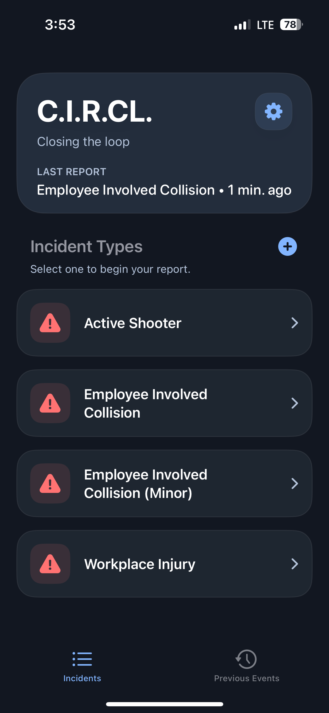
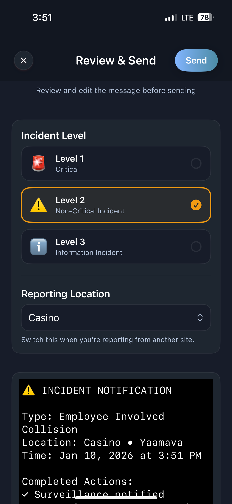
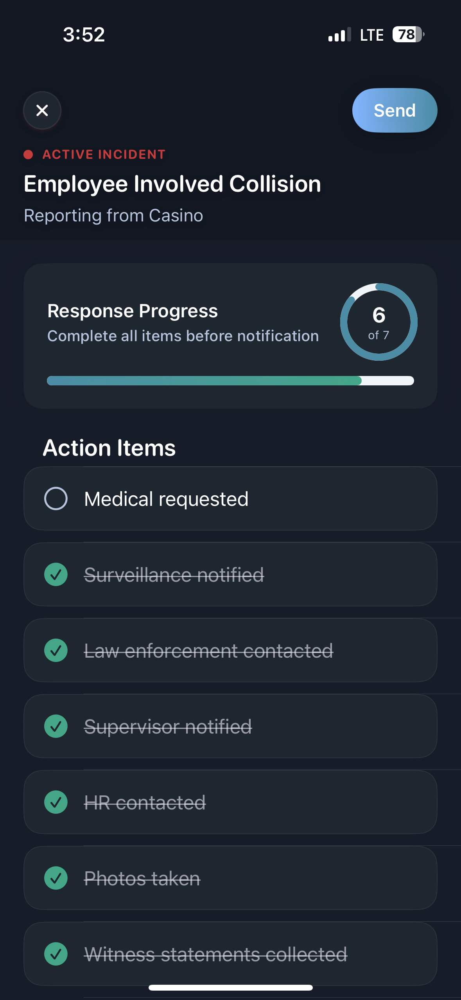
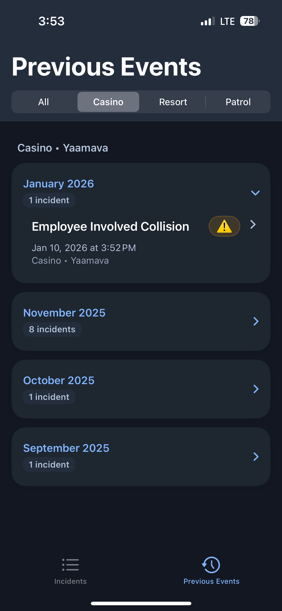

# 🚨 CIRCL — Incident Reporting & Operational Intelligence Platform (iOS)

CIRCL is a production-grade iOS application designed to modernize how teams report, track, and resolve real-world incidents across complex operational environments.

The app enables frontline staff and administrators to capture incidents in real time, collaborate across teams, and transform raw reports into actionable insights — all while supporting multi-tenant organizations, role-based access, and scalable data flows.

This repository showcases the iOS architecture and engineering patterns behind CIRCL, focusing on maintainability, scalability, and real-world constraints faced in enterprise applications.

---
## 📱 App Screenshots

  
  
  
  

## 🧩 What the app does

### Incident Reporting
Capture structured incident reports with contextual metadata (location, type, severity, attachments, and follow-ups), optimized for speed and accuracy in high-pressure environments.

### Multi-Organization Support
Built with a multi-tenant architecture, allowing multiple organizations to coexist securely while sharing global incident definitions and reporting standards.

### Role-Based Experiences
Different user roles (e.g. frontline staff, supervisors, administrators) experience tailored UI flows and capabilities, driven by centralized permission models.

### Actionable Insights
Incident data feeds reporting views and recommendations that help teams identify trends, improve response times, and standardize operational best practices.

### Offline-Resilient & Real-Time Ready
Designed with async data flows and state synchronization patterns that support intermittent connectivity and real-time updates.

---

## 🛠️ What this repository demonstrates

### Modern Swift & SwiftUI Architecture
Feature-based organization, reusable components, and clear separation of UI, domain, and data layers.

### Async/Await & Concurrency-Safe Design
Thoughtful use of Swift concurrency to avoid data races, ensure thread safety, and scale as features grow.

### Scalable State & Data Flow
Patterns that support complex user flows, multi-tenant data models, and evolving product requirements.

### Production-Minded Engineering
Decisions informed by real constraints: QA workflows, regressions, long-term maintainability, and team collaboration.

### Deliberate Tradeoffs
This is not a demo app — it reflects real decisions made to balance velocity, correctness, and future extensibility.
